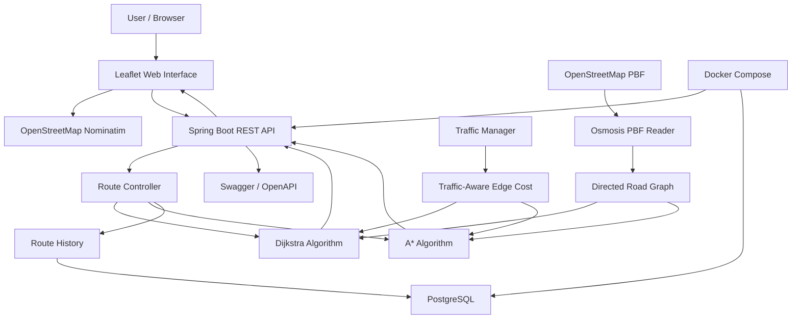

# System Architecture

## Intelligent Route Optimization System



## Request Flow

```text
User
  |
  v
Leaflet Web Interface
  |
  v
Spring Boot REST API
  |
  +-------------------+
  |                   |
  v                   v
Dijkstra              A*
  |                   |
  +---------+---------+
            |
            v
     Traffic-Aware
       Road Graph
            |
            v
       Route Response
            |
       +----+----+
       |         |
       v         v
    Leaflet   PostgreSQL
      Map     Route History
```

## Traffic Processing

```text
Base Road Speed
       |
       v
Traffic Level
       |
       v
Traffic Multiplier
       |
       +------------------+
       |                  |
       v                  v
Effective Speed     Adjusted Cost
       |                  |
       +--------+---------+
                |
                v
         Route Recalculation
```

## Deployment

```text
                 Docker Compose
                       |
          +------------+------------+
          |                         |
          v                         v
   Spring Boot App             PostgreSQL
      Port 8080                  Port 5432
          |
          v
     OSM Data Volume
          |
          v
      Routing Graph
```
